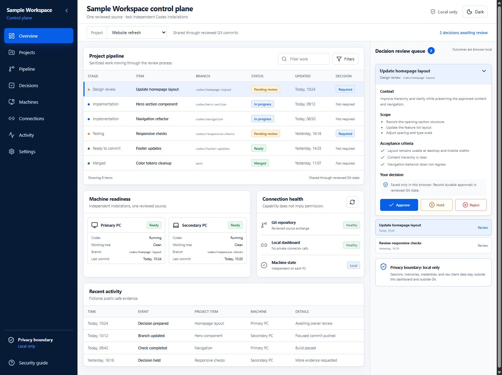

# Codex Dashboard Starter

A sanitized, dashboard-first control plane for one project owner working across
two independent Codex PCs.



This starter gives both installations the same review process without copying
Codex's machine-local state. Git shares approved source and sanitized dashboard
context. Sessions, memories, credentials, environment files, caches, browser
state, and private data stay local to each PC.

## What is included

- A responsive React + Vite operating dashboard
- Pipeline, decision queue, machine readiness, connection health, and activity
- Approve, hold, and reject outcomes stored only in the current browser
- A sanitized hidden JSON context for future Codex continuation
- Dashboard-first project instructions in `AGENTS.md`
- A two-PC installation and daily collaboration runbook
- Validation, tests, and a production build gate
- Fictional sample data that is safe to replace

## Quick start

Requirements: Git and Node.js 22 or newer on each PC.

```bash
git clone https://github.com/danox46/codex-dashboard-starter.git
cd codex-dashboard-starter
npm ci
npm run check
npm run dev
```

Open the local URL printed by Vite, normally <http://localhost:5173>.

## Use it for a real client

Do not store operational client data in this public starter. Create a new
**private** repository from it, then invite only approved collaborators.

1. Create an empty private repository in the client's GitHub organization.
2. On PC One, clone this starter, replace its public remote, and push the clean
   baseline to the private repository.
3. Customize the fictional sample state and `AGENTS.md` inside a reviewed branch.
4. On PC Two, clone the client's private repository with that machine's own
   GitHub credentials.
5. Validate both PCs independently with `npm ci && npm run check`.

The exact commands and conflict-safe daily workflow are in
[Two-PC setup](docs/TWO_PC_SETUP.md).

## Privacy boundary

Shared through Git:

- Source, documentation, sanitized state, decisions, and public-safe evidence

Kept local on every PC:

- Codex sessions, memories, caches, databases, credentials, tokens, cookies,
  environment files, browser state, raw client data, and machine configuration

Read [Security boundary](docs/SECURITY_BOUNDARY.md) before customization. The
browser's decision outcomes are intentionally local and are not a secure or
authoritative approval database. Record durable approved decisions in reviewed
dashboard state and Git commits.

## Commands

```bash
npm run dev       # local development
npm run validate  # privacy and repository-shape checks
npm test          # component and workflow tests
npm run build     # type-check and production build
npm run check     # all required checks
```

## Customize

Start with [Customization](docs/CUSTOMIZATION.md). Replace the fictional state,
rename the workspace, and adapt project-specific instructions only after the
owner reviews the intended boundary.

## License

MIT
